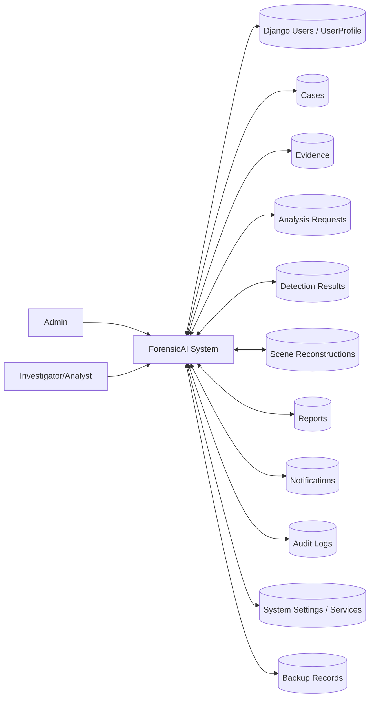
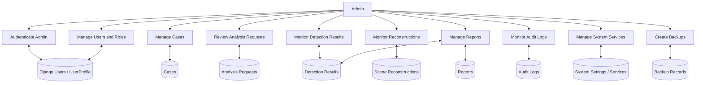
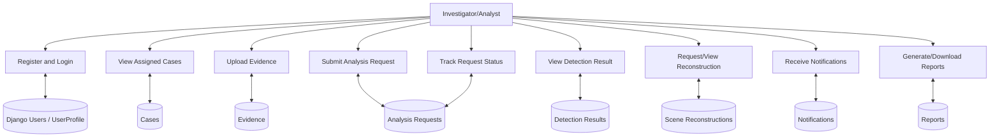
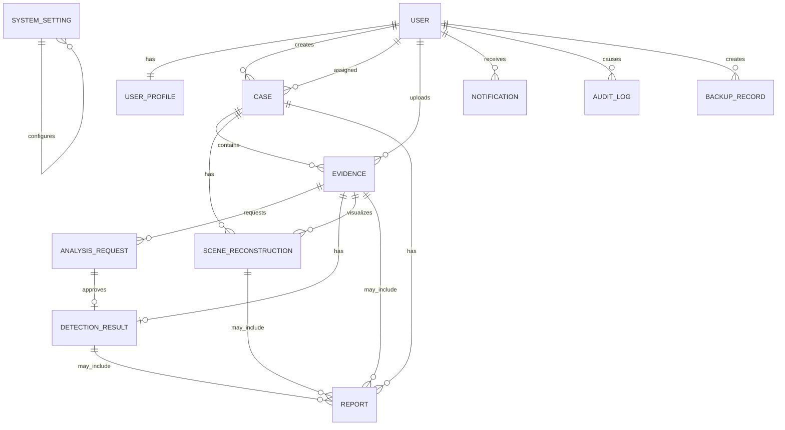

# ForensicAI Corrected System Design

## Correct Level-0 DFD



## Correct Level-1 Admin DFD



`View Detection Reports` reads stored Detection Results and Reports, not service toggles.

## Correct Level-1 User DFD



`Track Request Status` reads `AnalysisRequest`; there is no separate analysis-status datastore.

## Correct ER Design



Django's built-in authentication tables provide login and password storage. The application must not add a custom `LOGIN` entity or store plain-text passwords.

## Correct Structural Chart

```text
ForensicAI System
  Admin Module
  User Module
  Case Management Module
  Evidence Management Module
  Analysis Request Module
  AI Detection Module
  3D Reconstruction Module
  Notification Module
  Report Module
  Audit and Backup Module
```

The 3D output from a single image is described as monocular depth-based 2.5D crime-scene visualization using relative scene units unless calibrated multi-view scale data is supplied.
